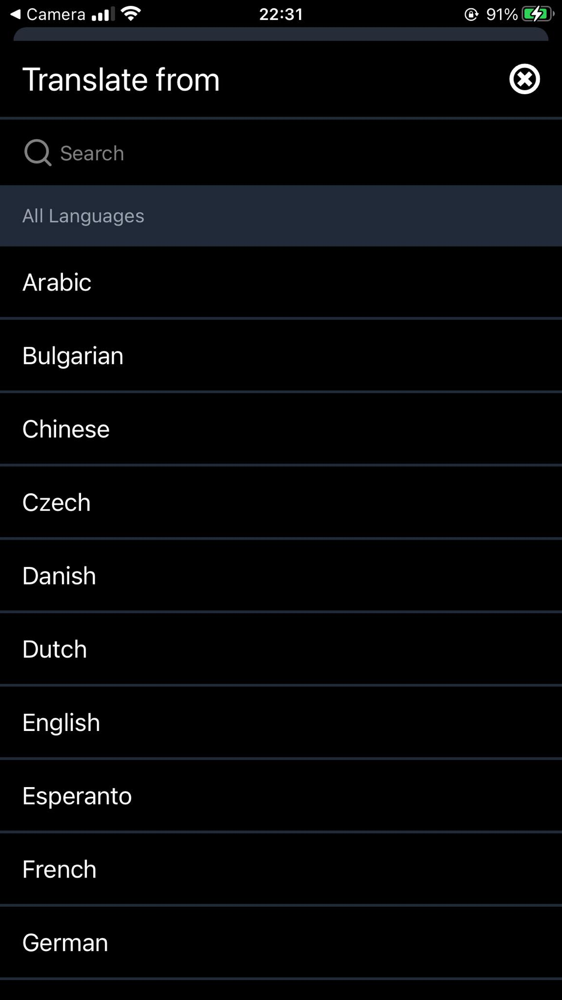
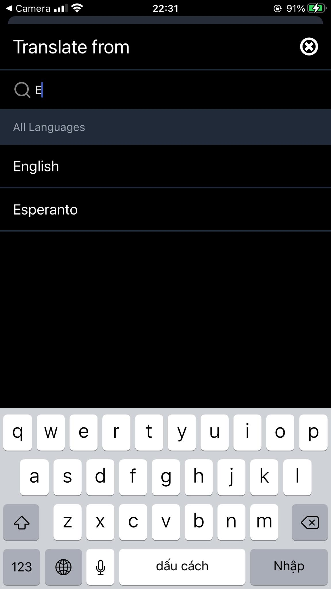

# language-translator-mobile-app
A language translating app like google translate written in javascript. The app development focuses on front-end side

>
 &nbsp; &nbsp;     
 &nbsp; &nbsp;

Stack i use to develop the app
- React native (javascript)
- Redux
- Tailwind css (native-wind lib)
- Apple authentication
- Google Translate API
> 

